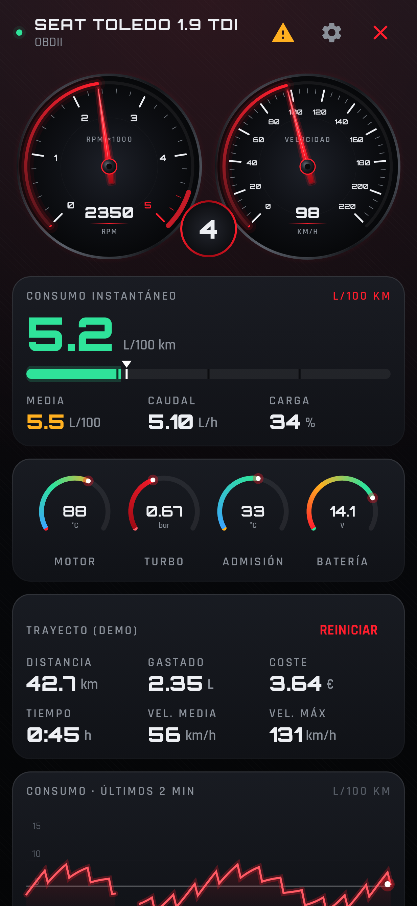
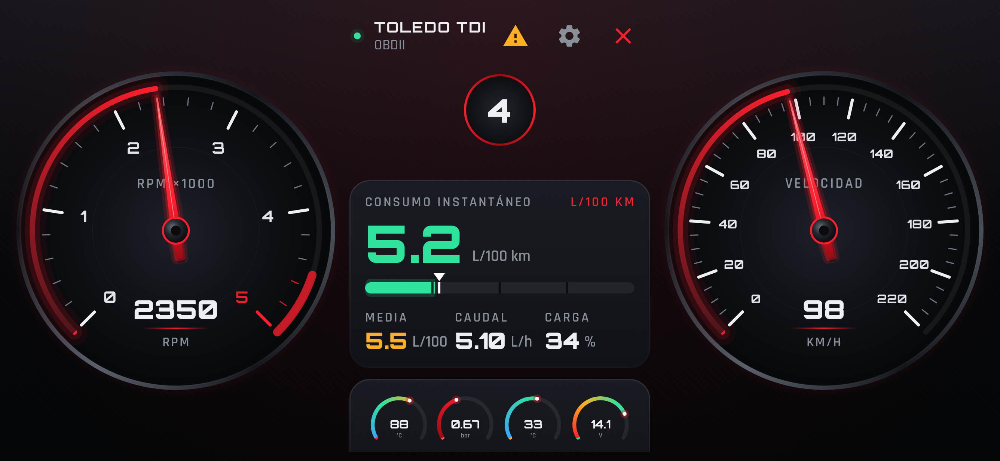

# Toledo OBD

Panel de instrumentos para Android que lee un adaptador **OBD2 Bluetooth (ELM327)** y muestra en tiempo real
los datos de un **SEAT Toledo II 1.9 TDI (2003)**, incluido el consumo en **L/100 km**, que el coche no trae de serie.

**APK lista para instalar:** [`release/ToledoOBD.apk`](release/ToledoOBD.apk) (Android 8.0 o superior).

| Vertical | Horizontal |
|---|---|
|  |  |

## Qué muestra

- **Cuentarrevoluciones y velocímetro** analógicos con agujas rojas y arco luminoso. Al abrir la app y al
  conectar, las agujas hacen el barrido de arranque, como en un cuadro real. En zona roja (4500 rpm o más)
  el arco parpadea.
- **Marcha engranada** (estimada a partir de rpm y velocidad, caja 02J de 5 marchas) con aviso de subir marcha.
- **Consumo instantáneo** en L/100 km (o en L/h si estás parado), con color verde, ámbar o rojo y una barra
  que marca tu consumo medio.
- **Consumo medio, caudal (L/h) y carga del motor.**
- Relojes pequeños: **temperatura del motor, presión del turbo, temperatura de admisión y batería**, con
  avisos de motor frío, sobretemperatura o tensión baja.
- **Trayecto:** distancia, litros gastados, coste en €, tiempo, velocidad media y velocidad máxima. Se guarda
  al cerrar la app y se reinicia a mano.
- **Gráfica** del consumo de los últimos 2 minutos.
- **Lectura y borrado de códigos de avería** OBD genéricos, con su descripción.
- **Modo demo** para ver el panel sin estar en el coche.

## Cómo usarla

1. Empareja el adaptador en *Ajustes de Android → Bluetooth* (PIN habitual: `1234` o `0000`).
2. Pon el contacto o arranca el motor, abre la app y pulsa **CONECTAR OBD**.
3. La primera conexión puede tardar 10-20 s, porque el Toledo usa línea K (ISO 9141 / KWP2000), que es lenta
   al iniciarse. Después, la app se reconecta sola al último adaptador usado.

## Sobre el cálculo del consumo

La centralita EDC15 del TDI no envía el caudal de combustible por OBD, así que la app lo **estima** a partir de
la carga del motor (PID 04) y las rpm: cantidad inyectada ≈ carga × inyección máxima del motor elegido en
Ajustes (90, 110, 130 o 150 CV). Si la centralita envía el PID 5E (caudal real), la app lo usa directamente.

Para afinar la cifra, en **Ajustes → Calibración**:

1. Llena el depósito y reinicia el trayecto.
2. Conduce con normalidad.
3. Al volver a llenar, escribe los litros repostados y pulsa **AJUSTAR**.

En *Ajustes → Ver registro OBD* aparece la comunicación con el adaptador, por si algo no conecta.

## Compilar

```bash
./gradlew assembleRelease   # APK en app/build/outputs/apk/release/
./gradlew testDebugUnitTest # tests del parser OBD y del modelo de consumo
```

GitHub Actions compila el APK en cada push (workflow *Compilar APK*).
La APK se firma con `app/toledo-release.jks`. Es una clave de uso personal y conviene conservarla, porque
permite instalar versiones nuevas encima de la anterior sin desinstalar.

Fuentes Orbitron y Rajdhani con licencia SIL Open Font License (`FONTS_LICENSE_OFL.txt`).
